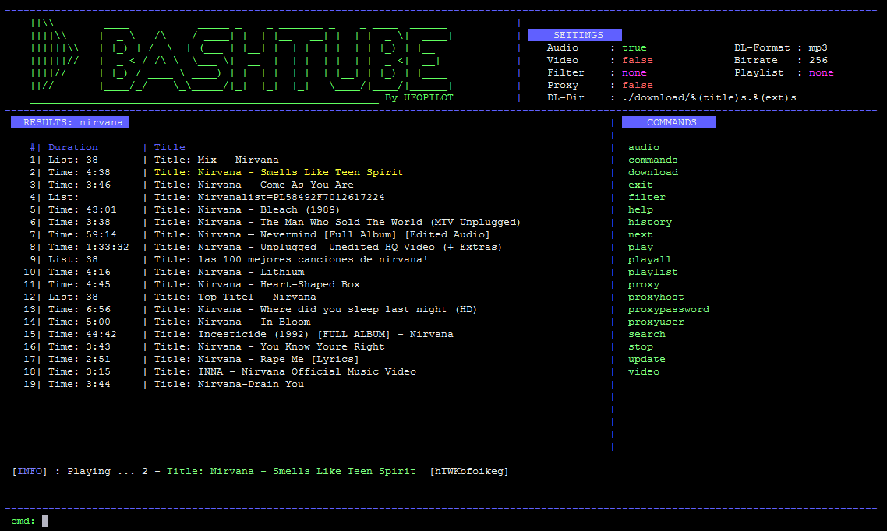
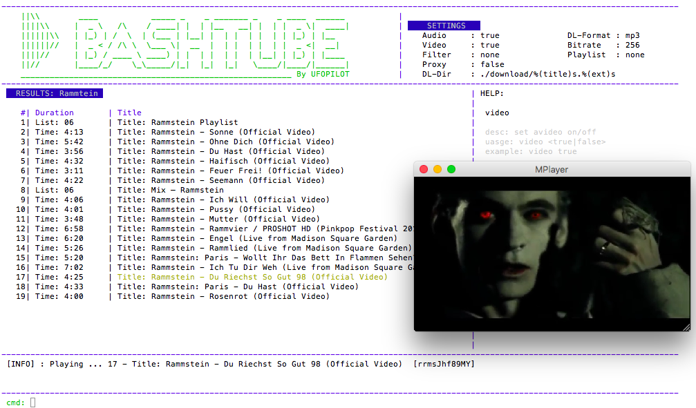

bashtube
===========

Features
--------
- Search and play audio/video from YouTube
- Create, save and play local playlists
- Download and convert to mp3
- Works with Windows and MacOS
- Requires mplayer, ffmpeg, ffprobe and youtube-dl

bashtube is a terminal based program to search, stream and download music.  This implementation uses YouTube as a source of content and can play and download video as well as audio. 

Screenshots
-----------

Windows
~~~~~~

Mac
~~~~~~

